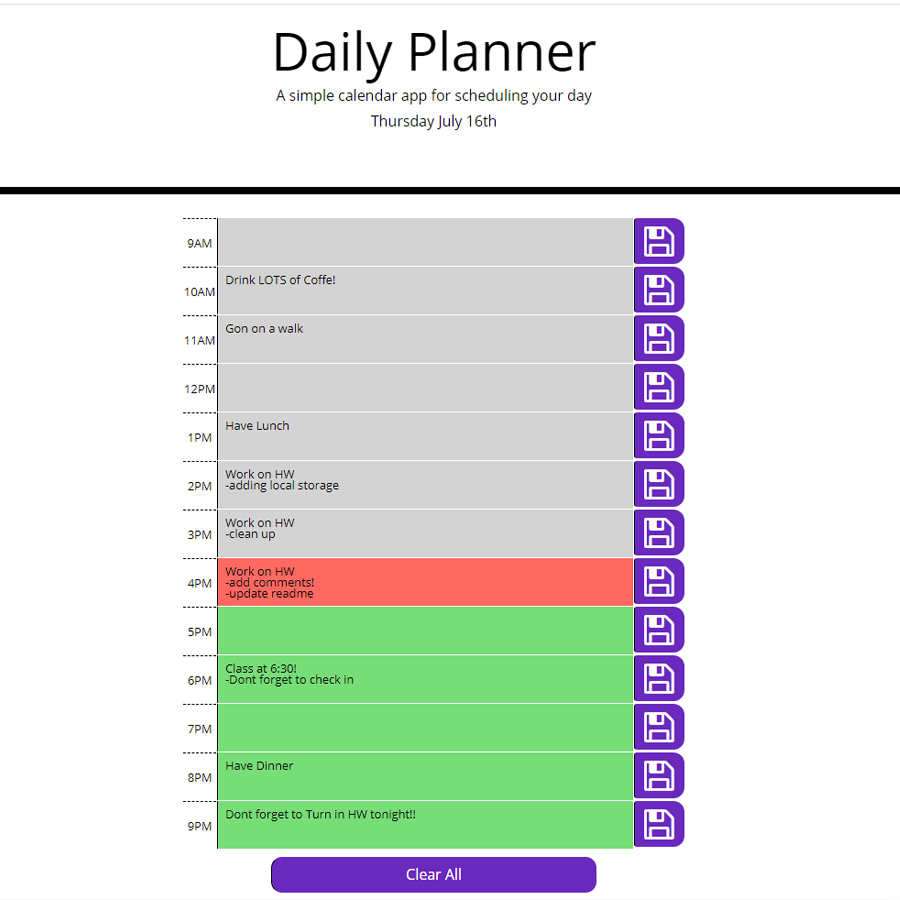

# Daily-Planner-App
This app features dynamically updated HTML and CSS powered by jQuery and uses the Moment.js library to work with date and time.

# Use

### Save different tasks and events by the hour of the day!
- Click on colored textarea corresponding to desired time
- Type whichever event or task you would like to acomplish
- Simply click on the purple button to the right of text box to save!
#### Note: Different colors indicate past present and future

- - -
[Daily Planer App](https://santu14.github.io/Daily-Planner-App/)
